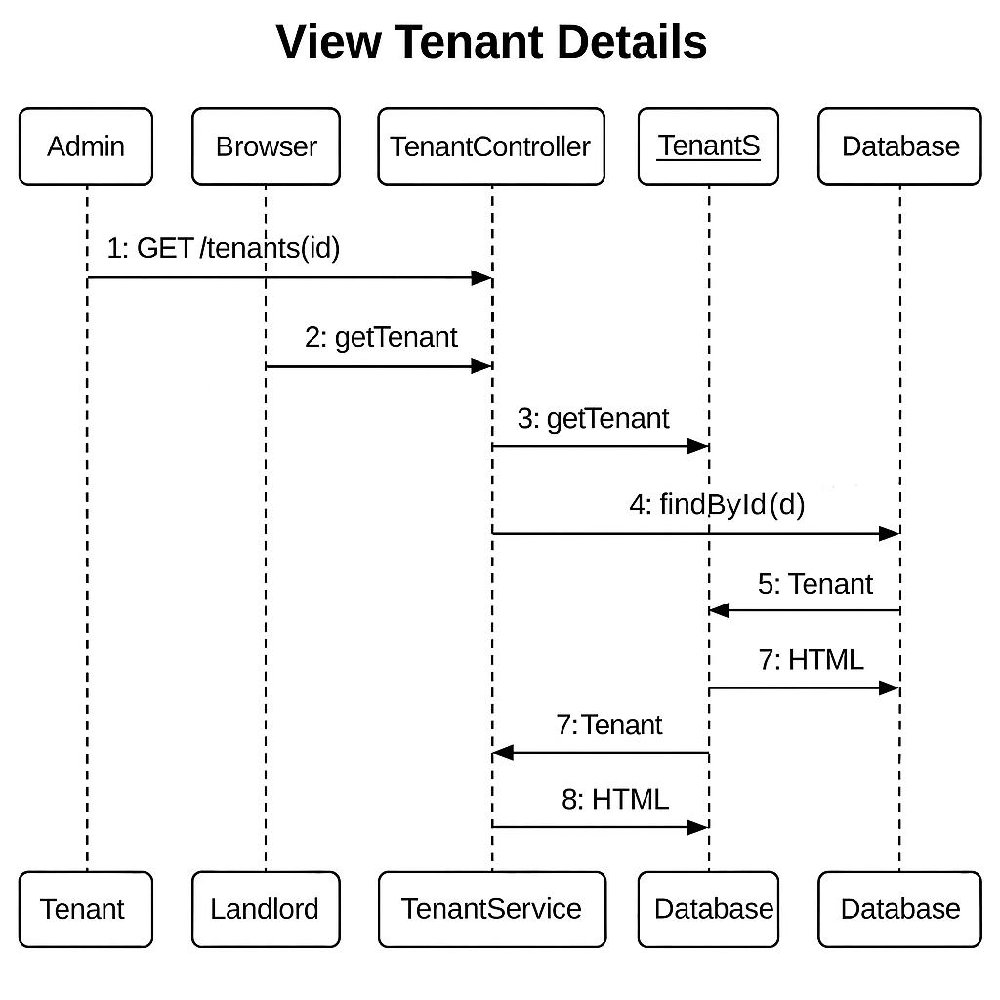
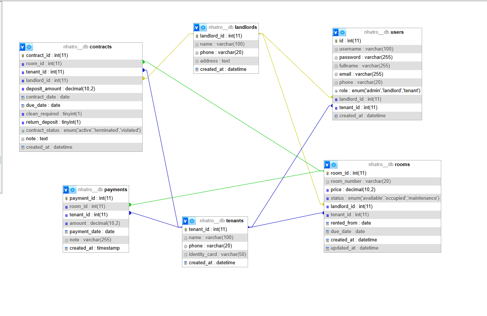
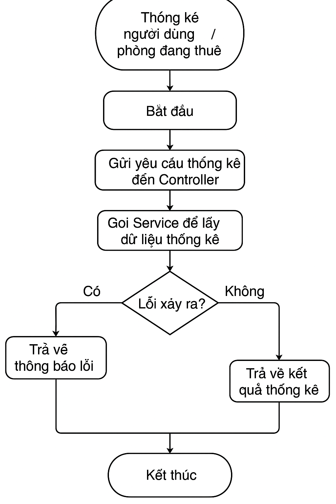

# Quản lý nhà trọ - Group 10 OOP N02 TERM 3 2025

## Nhóm thực hiện
- Đặng Thanh Tùng  
- Lê Hồng Quốc  
- Lê Quang Thắng  

## Repository
🔗 [GitHub Repository](https://github.com/hoangquoc03/Group10_OOP_N02_term3_2025)

---

## 🏠 Giới thiệu Dự án

Ứng dụng **Quản lý phòng trọ** giúp quản lý thông tin về người thuê, phòng trọ và chủ nhà, xây dựng bằng **Java Spring Boot**, sử dụng **file nhị phân** để lưu dữ liệu và các collection trong Java như `ArrayList`, `LinkedList`, `Map`.

---
## Sequence Diagram :

 

## Class Diagram :

## Lưu đồ thuật toán: Thống kê người dùng/phòng đang thuê

 

## Lê Hồng Quốc : 

## Đặng Thanh Tùng :

##  Lê Quang Thắng :

## 📦 Mô hình đối tượng
class Room {
    String roomID;
    double price;
    status ENUM('available', 'occupied', 'maintenance'),
    landlord_id INT,
    tenant_id INT,
    rented_from DATE,
    due_date DATE,
    created_at DATETIME,
    updated_at DATETIME,
}

class Tenant {
    String nameT;
    String nameID;
    String phoneTenant;
    String phongThue;
}

class Landlord {
    String landlordID;
    String nameL;
    String phoneLandlord;
}

## 📋 Chức năng chính

| Đối tượng   | Chức năng                                         |
|-------------|--------------------------------------------------|
| Tenant      | Thêm/Sửa/Xoá, Xem danh sách, Gán phòng           |
| Room        | Thêm/Sửa/Xoá, Xem trạng thái, Gán tenant         |
| Landlord    | Thêm/Sửa/Xoá, Quản lý danh sách phòng sở hữu     |
| Contract    |  Quản lý hợp đồng thuê phòng                     |
| Thống kê    | Thống kê số lượng người dùng, phòng đang thuê    |

## 🧪 Kiểm thử & Xử lý lỗi

- Sử dụng `try-catch` để bắt lỗi khi thao tác với cơ sở dữ liệu hoặc dữ liệu không hợp lệ.
- API REST sử dụng `ResponseEntity` để trả về mã lỗi HTTP phù hợp.
- Ví dụ:
try {
    // logic
} catch (Exception e) {
    return ResponseEntity.status(500).body("Lỗi: " + e.getMessage());
}

## ☁️ Kết nối Cơ sở dữ liệu:

- Cơ sở dữ liệu sử dụng: **MySQL trên nền tảng Aiven**
- Cấu hình trong `application.properties`:
spring.datasource.url=jdbc:mysql://mysql-1535c414-project-18.b.aivencloud.com:15714/db-onl?sslMode=REQUIRED&serverTimezone=Asia/Ho_Chi_Minh
spring.datasource.username=avnadmin
spring.datasource.password
spring.datasource.driver-class-name=com.mysql.cj.jdbc.Driver

