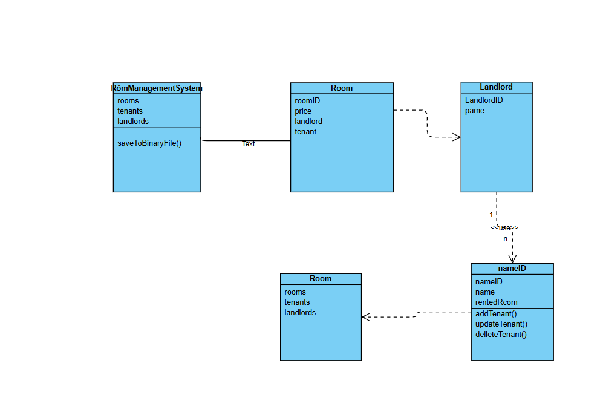
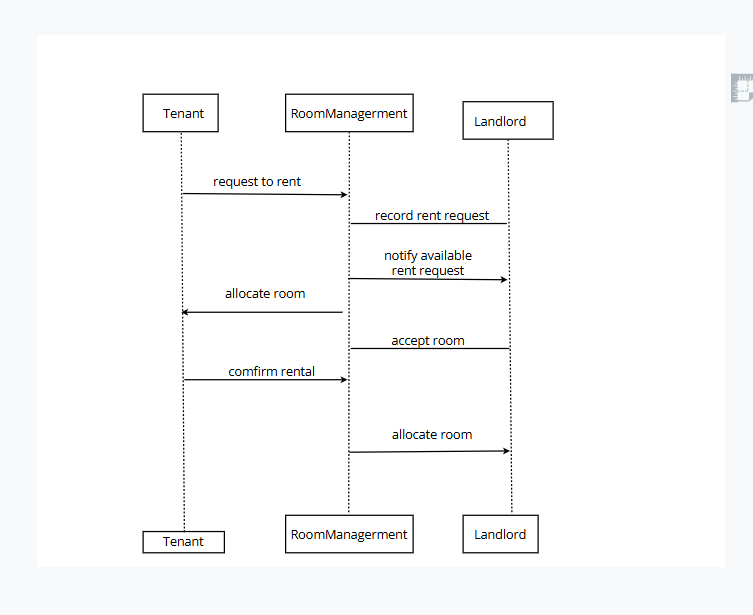
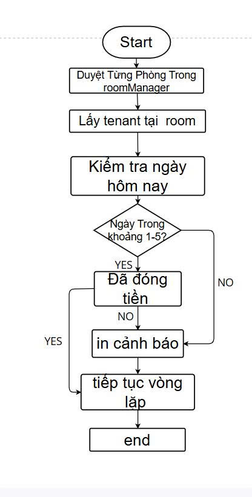
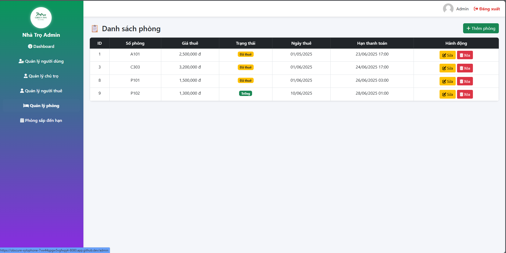
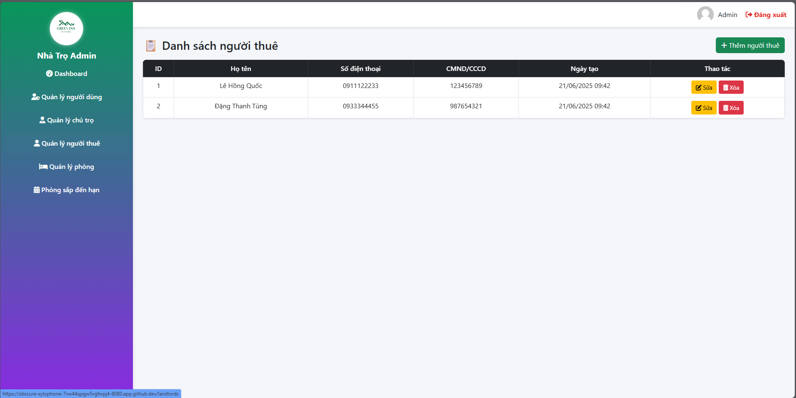
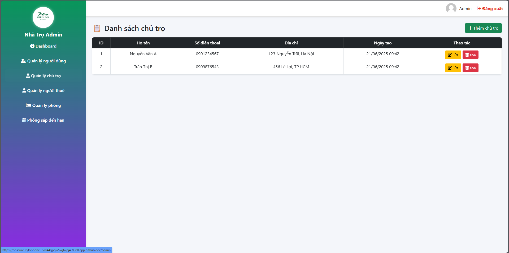
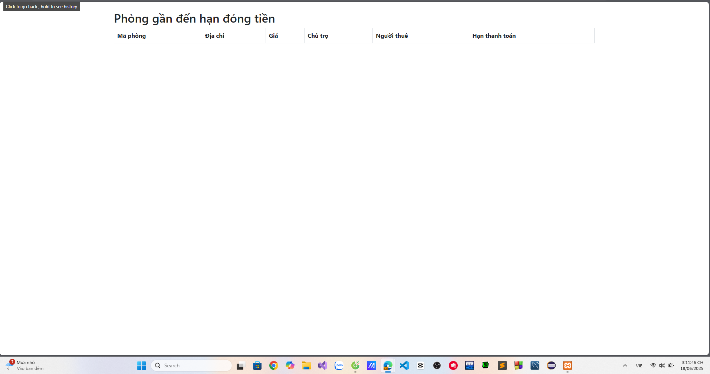

# Quản lý nhà trọ - Group 10 OOP N02 TERM 3 2025

## Nhóm thực hiện
- Đặng Thanh Tùng  
- Lê Hồng Quốc  
- Lê Quang Thắng  

## Repository
🔗 [GitHub Repository](https://github.com/hoangquoc03/Group10_OOP_N02_term3_2025)

---

## 🏠 Giới thiệu Dự án

Ứng dụng **Quản lý phòng trọ** giúp quản lý thông tin về người thuê, phòng trọ và chủ nhà, xây dựng bằng **Java Spring Boot**, sử dụng **file nhị phân** để lưu dữ liệu và các collection trong Java như `ArrayList`, `LinkedList`, `Map`.

---
## Sequence Diagram
 
## Lưu đồ thuật toán: kiemTraNgayDongTien()
 

## Lê Hồng Quốc : 


## Đặng Thanh Tùng :



##  Lê Quang Thắng :


## 📦 Mô hình đối tượng

```java
class Room {
    String roomID;
    double price;
}

class Tenant {
    String nameT;
    String nameID;
    String phoneTenant;
    String phongThue;
}

class Landlord {
    String landlordID;
    String nameL;
    String phoneLandlord;
}
Chức năng chính
🔸 Quản lý Người thuê (Tenant)
Thêm, sửa, xoá tenant

Liệt kê thông tin tenant: nameT, nameID, phoneTenant

Lọc tenant theo:

Tên (nameT)

Số điện thoại (phoneTenant)

Mã người thuê (nameID)

🔸 Quản lý Phòng trọ (Room)
Thêm, sửa, xoá phòng

Gán Tenant cho Room

Mỗi phòng chỉ có 1 tenant tại một thời điểm

🔸 Quản lý Chủ nhà (Landlord)
Thêm, sửa, xoá thông tin chủ nhà


💾 Lưu trữ dữ liệu
Dữ liệu được lưu dưới dạng file nhị phân

Dùng các class Room, Tenant, Landlord để đọc/ghi file

Sử dụng các lớp RoomService, TenantService, LandlordService để thao tác dữ liệu

Dữ liệu trong bộ nhớ được lưu dưới dạng:

ArrayList<Room>

LinkedList<Tenant>

Map<String, Landlord>

📈 Sơ đồ & Thuật toán
🔹 Sequence Diagram
 
🔹 Lưu đồ thuật toán: kiemTraNgayDongTien()

