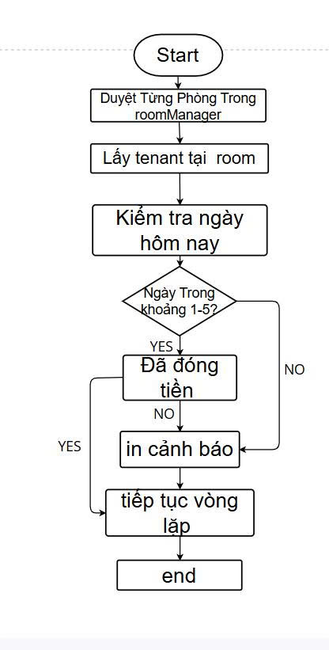

# Group 10 OOP N02 TERM 3 2025

**Group 10: OOP Term 3 2025 - K17**

## Thành viên
- Đặng Thanh Tùng  
- Lê Hồng Quốc  
- Lê Quang Thắng  

## Tiêu đề
**Quản lý nhà trọ**

## Giới thiệu Project (README)
[Link đến GitHub Repository](https://github.com/hoangquoc03/Group10_OOP_N02_term3_2025)

---

## Đối tượng

```java
class Room {
    String roomID;
    double price;
}

class Tenant {
    String nameT;
    String nameID;
    String phoneTenant;
    String phongThue;
}

class Landlord {
    String landlordID;
    String nameL;
    String phoneLandlord;
}

Yêu cầu số 3
Nội dung 01: Xây dựng ứng dụng Quản lý phòng trọ
Yêu cầu:
Giao diện sử dụng Java Spring Boot

Chức năng quản lý Người thuê (Tenant):

Thêm, sửa, xoá Tenant

Liệt kê thông tin: name, nameID, phoneTenant

Lọc theo:

Tên (nameT)

Số điện thoại (phoneTenant)

Mã người thuê (nameID)

Chức năng quản lý Phòng trọ (Room):

Thêm, sửa, xoá Room

Gán Tenant cho Room

Mỗi Room chỉ được gán cho một Tenant tại một thời điểm

Lưu trữ dữ liệu bằng file nhị phân

Tạo các lớp Room, Tenant, Landlord để đọc/ghi dữ liệu

Sử dụng các lớp TenantService, RoomService, LandlordService để thao tác dữ liệu

Dữ liệu trong bộ nhớ lưu trữ dưới dạng các Collection như:

ArrayList<Room>

LinkedList<Tenant>

Map, ...

Sinh viên có thể tự thêm chức năng nâng cao để mở rộng ứng dụng (tuỳ chọn)
Nội dung 02:
Sequence Diagram:
 
Lưu đồ thuật toán: kiemTraNgayDongTien()
 ```

